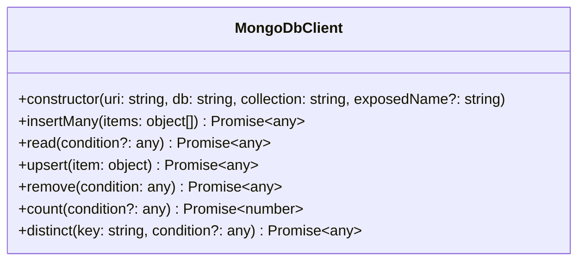

# electronade-mongodbclient-util

It's a package that provides some utilities for [electronade-mongodbclient](https://electronade-mongodbclient.netlify.app).


[](https://www.npmjs.com/package/electronade-mongodbclient-util)

It's an optional module for `electronade-mongodbclient` so `electronade-mongodbclient` should be installed before using `electronade-mongodbclient-util`.

## installation
``` shell
npm install electronade-mongodbclient-util
```
## what exported

MongoDbClient class is exported from the package that class provides the methods calling `electronade-mongodbclient` features.


